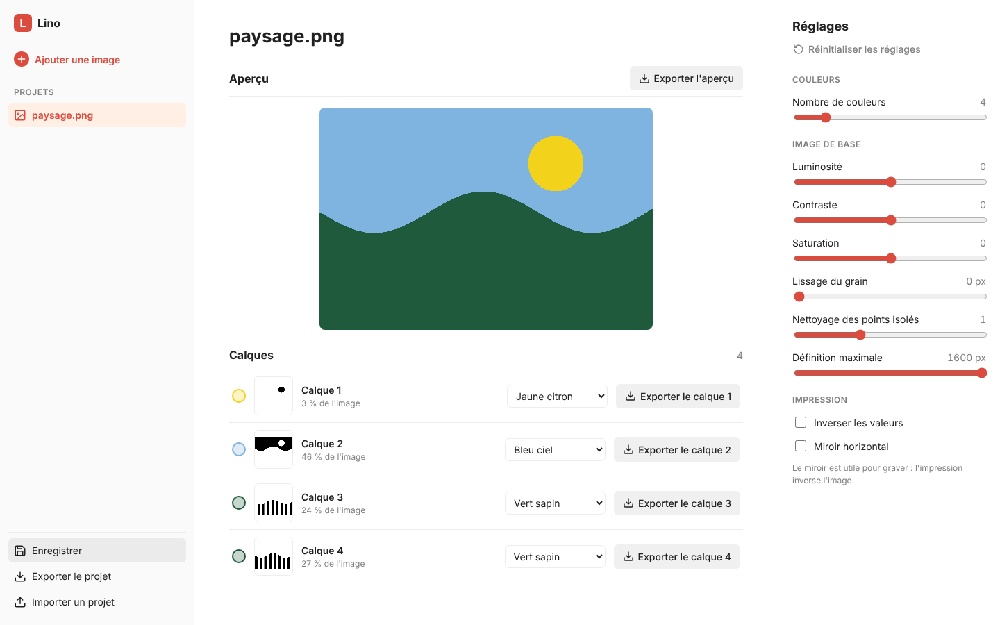
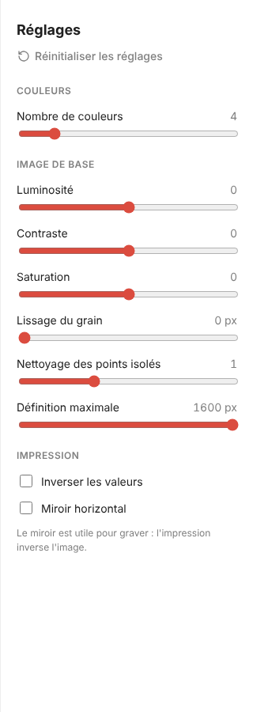
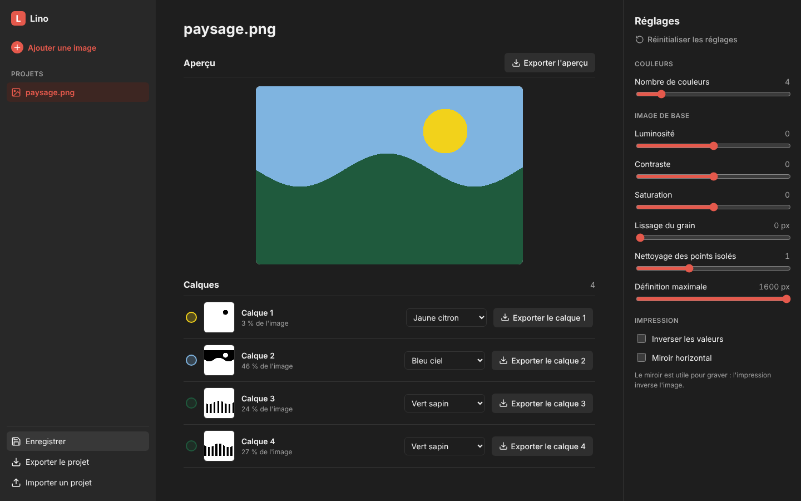
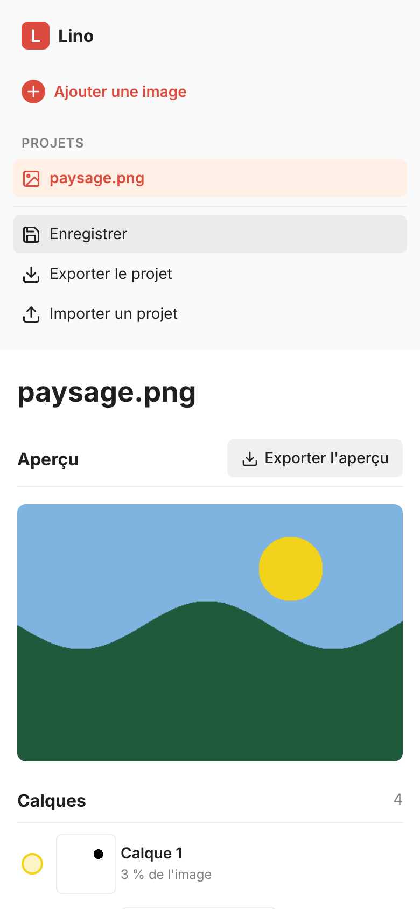

# Lino

[](https://github.com/charlescoiffier/lino/actions/workflows/deploy.yml)

Une application web qui prépare une image pour la **linogravure** : elle la sépare en calques, un par passage
d'encre, attribue une teinte à chacun et exporte les calques en noir et blanc, prêts à imprimer ou à transférer sur le lino.

**Essayer l'application : https://charlescoiffier.github.io/lino/**

Aucune installation : tout se passe dans le navigateur, et vos images ne quittent jamais votre appareil.

## Aperçu



| Les réglages de l'image | Mode sombre | Sur téléphone |
|---|---|---|
|  |  |  |

---

# Pour tout le monde

## Le projet en bref

En linogravure, chaque couleur demande sa propre plaque : on grave une plaque par passage d'encre, puis on imprime
les plaques l'une après l'autre sur la même feuille. Il faut donc partir d'une image découpée en zones de couleur
bien distinctes, une zone par plaque.

Lino fait ce découpage. Vous choisissez le **nombre de couleurs** (de 2 à 16) ; Lino regroupe les couleurs de
l'image en autant de familles et en tire un **calque** par famille. Chaque calque reçoit une **teinte d'encre**,
choisie dans une bibliothèque d'encres de linogravure. Les calques s'exportent en noir et blanc : le noir est ce qui
reçoit l'encre, le blanc ce qui sera creusé.

C'est un outil personnel : pas de compte, pas de serveur, rien à installer.

## Utiliser l'application

1. **Ajouter une image** : le bouton « Ajouter une image » en haut à gauche accepte une photo ou un dessin
   (PNG, JPEG, WebP… tout ce que votre navigateur sait lire). Une image très grande est réduite automatiquement.
2. **Choisir le nombre de couleurs** avec le curseur du panneau « Réglages ». L'aperçu et les calques se mettent à
   jour. Si l'image contient moins de couleurs distinctes que demandé, vous obtenez simplement moins de calques.
3. **Ajuster l'image de base** (voir plus bas) pour obtenir des zones plus nettes ou plus simples à graver.
4. **Choisir une teinte par calque**. Lino propose d'abord l'encre la plus proche de la couleur du calque ; vous
   pouvez en changer. Votre choix est conservé quand vous modifiez ensuite un réglage sans changer le nombre de calques.
5. **Exporter** : un bouton par calque, et un pour l'aperçu en couleurs.

Les calques sont triés du plus clair (calque 1) au plus sombre. Chaque ligne indique la part de l'image qu'elle couvre.

### Les réglages de l'image

| Réglage | Effet |
|---|---|
| Nombre de couleurs | Nombre de calques voulus, de 2 à 16. |
| Luminosité | Éclaircit ou assombrit toute l'image (de −100 à +100). |
| Contraste | Écarte ou rapproche les clairs et les foncés (de −100 à +100). |
| Saturation | Rend les couleurs plus vives ou plus ternes ; −100 donne des gris (de −100 à +100). |
| Lissage du grain | Floute légèrement l'image avant le découpage (de 0 à 5 px) : utile pour une photo bruitée, qui donnerait sinon des calques piquetés. |
| Nettoyage des points isolés | Supprime les pixels seuls au milieu d'une autre zone, qu'il serait impossible de graver (de 0 à 3 passes). |
| Définition maximale | Taille maximale de l'image traitée, de 400 à 1600 px sur le grand côté. Moins de pixels, c'est un calcul plus rapide et des zones plus larges. |
| Inverser les valeurs | Échange clairs et foncés. |
| Miroir horizontal | Retourne l'image de gauche à droite. L'impression inverse l'image : graver à l'envers donne un tirage dans le bon sens, ce qui compte surtout avec du texte. |

« Réinitialiser les réglages » remet tout à zéro (et 4 couleurs).

### Enregistrer et exporter

- **Exporter le calque K** : un PNG noir et blanc nommé `calque-K.png` (noir = encre).
- **Exporter l'aperçu** : un PNG en couleurs avec les teintes choisies, nommé `apercu.png`.
- **Enregistrer** : garde le projet (image, nombre de couleurs, teintes, réglages) dans le navigateur. Les projets
  apparaissent dans la barre de gauche, où l'on peut les rouvrir ou les supprimer.
- **Exporter le projet** / **Importer un projet** : un fichier `.lino.json`, pour sauvegarder un projet, le déplacer
  sur un autre appareil ou en garder une copie.

### Limites

- Les projets enregistrés restent **dans le navigateur** où vous les avez créés : ils ne se synchronisent pas entre
  appareils. Utilisez l'export de projet pour les déplacer. Si le navigateur interdit le stockage local (navigation
  privée, par exemple), l'application le signale et reste utilisable, sans sauvegarde.
- Les calques sont exportés à la taille traitée, 1600 px au plus sur le grand côté.
- Les pixels transparents d'une image PNG comptent comme du blanc.
- Pas de vectorisation (SVG) dans cette version.

---

# Pour les développeurs

## Démarrage

Prérequis : Node.js 20 ou plus récent.

```bash
npm install
npm run dev               # serveur de développement (http://localhost:5173)
npm test                  # tests unitaires (Vitest)
npm run build             # vérification des types + build de production dans dist/
npm run preview           # sert le build de production (http://localhost:4173)
npm run e2e               # tests de bout en bout (Playwright) ; construit puis sert l'application
npm run capture:readme    # régénère les images du README (docs/images/)
```

Pour Playwright, `npx playwright install --with-deps chromium` installe le navigateur. Avec un Chromium déjà présent,
indiquez son chemin : `PW_CHROMIUM_PATH=/chemin/vers/chrome npm run e2e` (ou `CHROME_PATH` pour `capture:readme`).

## Technologies

React + TypeScript + [Vite](https://vite.dev/). Les algorithmes sont des fonctions pures, sans DOM, exécutées dans un
**Web Worker** ; le rendu passe par Canvas / OffscreenCanvas. [idb-keyval](https://github.com/jakearchibald/idb-keyval)
pour IndexedDB, [Vitest](https://vitest.dev/) et [fake-indexeddb](https://github.com/dumbmatter/fakeIndexedDB) pour les
tests unitaires, [Playwright](https://playwright.dev/) pour le parcours complet. Application 100 % statique, aucun
serveur. Pas de bibliothèque de composants ni de CSS-in-JS : une seule feuille de style (`src/ui/app.css`).

## Organisation du code

| Dossier / fichier | Rôle |
|---|---|
| `src/core/types.ts` | Types partagés : `RgbaImage`, `Lab`, `Rgb`. |
| `src/core/color.ts` | Conversion sRGB ⇄ Lab (D65). |
| `src/core/adjust.ts` | Réglages (`Settings`, valeurs par défaut, bornes, `normalizeSettings`) et `adjustImage` : fond blanc, lissage, tonalité, inversion, miroir. |
| `src/core/quantize.ts` | Quantification k-means dans Lab : image + N → indices de calques + centroïdes. |
| `src/core/layers.ts` | `despeckle` (nettoyage des pixels isolés) et `layerMasks` (un masque binaire par calque). |
| `src/core/pipeline.ts` | `processImage` : réglages → quantification → nettoyage. Appelé par le worker. |
| `src/core/palette.ts` | Chargement et validation d'une palette JSON, teinte la plus proche. |
| `src/core/render.ts` | RGBA de l'aperçu (`compositeRgba`) et des masques (`maskRgba`). |
| `src/workers/` | `process.worker.ts` (enveloppe du pipeline), `protocol.ts` (messages), `client.ts` (`ProcessingClient`, annulable). |
| `src/store/projects.ts` | IndexedDB (projets) et fichier projet (export / import). |
| `src/ui/` | `App.tsx` (état et composition), `Sidebar.tsx`, `SettingsPanel.tsx`, `LayerCard.tsx`, `RgbaCanvas.tsx`, `Icon.tsx`, `loadImage.ts`, `export.ts`, `app.css`. |
| `public/palettes/` | Bibliothèques de teintes (JSON). |
| `e2e/` | Tests Playwright. |
| `scripts/capture-readme.mjs` | Génère les images du README. |
| `docs/superpowers/` | Spécification de conception et plan d'implémentation de la version 1. |

Les tests unitaires (`*.test.ts`) sont à côté du code qu'ils testent.

## Le traitement d'une image

`processImage` (`src/core/pipeline.ts`) enchaîne trois étapes :

1. **`adjustImage`** : l'image est d'abord posée sur fond blanc (les pixels transparents deviennent blancs et opaques),
   puis, dans cet ordre : lissage (flou en boîte, séparable, rayon 0 à 5), saturation, luminosité puis contraste,
   inversion, miroir horizontal. Avec les réglages par défaut, une image opaque ressort inchangée.
2. **`quantize`** : conversion en Lab, puis k-means. Initialisation de type k-means++ (graine fixe, donc résultat
   déterministe), centroïdes calculés sur un échantillon d'environ 50 000 pixels, 20 itérations au plus, arrêt anticipé
   à la convergence ; tous les pixels sont ensuite affectés au centroïde le plus proche. Les clusters vides sont
   supprimés (une image unie donne un seul calque) et les calques sont triés du plus clair au plus sombre.
   `RangeError` si N n'est pas un entier de 2 à 16, ou si l'image est vide.
3. **`despeckle`** : un pixel sans aucun voisin (8-connexité) de même étiquette prend l'étiquette majoritaire de ses
   voisins. Le réglage « nettoyage » répète cette passe 0 à 3 fois.

`layerMasks` produit ensuite un masque par calque : les masques sont disjoints et leur union couvre l'image.

## Worker et annulation

`ProcessingClient` (`src/workers/client.ts`) crée un worker par calcul. Un nouvel appel à `run` annule le précédent :
la promesse en cours est rejetée avec `CancelledError` et son worker est terminé. Une réponse portant un ancien `id`
est ignorée, donc seule la dernière demande est appliquée. Dans `App.tsx`, les curseurs de réglage réagissent tout de
suite mais le recalcul attend 150 ms de calme (anti-rebond). La **définition maximale** agit au chargement de l'image
(`loadImage`), pas dans le worker : la changer recharge l'image.

## Teintes

Les teintes sont dans `public/palettes/*.json`. Format :

```json
{
  "id": "linocut-inks",
  "name": "Encres de linogravure",
  "swatches": [
    { "id": "noir", "name": "Noir", "hex": "#16161a" },
    { "id": "rouge-vermillon", "name": "Rouge vermillon", "hex": "#d93a26", "ref": "R-01" }
  ]
}
```

`id` est unique dans la palette, `hex` s'écrit `#rrggbb`, `ref` (référence d'encre) est facultatif. `parsePalette`
rejette une palette invalide avec un message « Palette invalide : … ». L'application charge `linocut-inks.json`.
La teinte proposée pour un calque est la plus proche de son centroïde, mesurée dans Lab.

## Persistance

Les projets sont dans IndexedDB (`src/store/projects.ts`, clés `project:<id>`). Un projet contient l'image d'origine
(octets et type), le nombre de couleurs, les teintes choisies et les réglages. Le fichier d'export est un JSON
(`version: 1`, image en base64) : `projectFromFile` valide sa structure, et des `settings` absents (ancien projet) ou
hors bornes sont ramenés à des valeurs valides par `normalizeSettings`. Si IndexedDB est indisponible, `App` bascule en
mode sans sauvegarde et le signale dans la barre latérale.

## Tests

- **Vitest** (`npm test`) : couleur, quantification (nombre de calques, transparence, image unie, N hors bornes),
  réglages, calques (masques disjoints couvrant l'image), palettes, client de worker (annulation, réponses périmées),
  redimensionnement, projets (IndexedDB simulée, fichier projet).
- **Playwright** (`npm run e2e`) : charger une image, séparer en 4 calques, changer N, attribuer des teintes, exporter,
  fichier qui n'est pas une image, enregistrer puis rouvrir un projet, réglages et réinitialisation.

## Publication

Le workflow `.github/workflows/deploy.yml` (**GitHub Actions**) s'exécute à chaque push sur `main` : installation
(`npm ci`), tests, build, puis publication sur **GitHub Pages** (https://charlescoiffier.github.io/lino/). Le badge en
tête de ce fichier reflète l'état du dernier run.

- Le site est servi dans un sous-dossier : `vite.config.ts` lit la variable `BASE_PATH`, que le workflow fixe à
  `/<dépôt>/`. Sans elle, le site est servi à la racine, comme en local.
- La source de GitHub Pages doit être réglée sur **GitHub Actions** (Settings → Pages), une seule fois.
- GitHub Pages met les fichiers en cache une dizaine de minutes : après un déploiement, un rechargement forcé
  (Cmd/Ctrl + Maj + R) affiche la nouvelle version.

## Images du README

`npm run capture:readme` (`scripts/capture-readme.mjs`) construit l'application, la sert avec `vite preview`, charge
une image d'exemple fabriquée par le script et enregistre les captures (bureau, panneau de réglages, mode sombre,
mobile) dans `docs/images/`. Les images sont versionnées.
